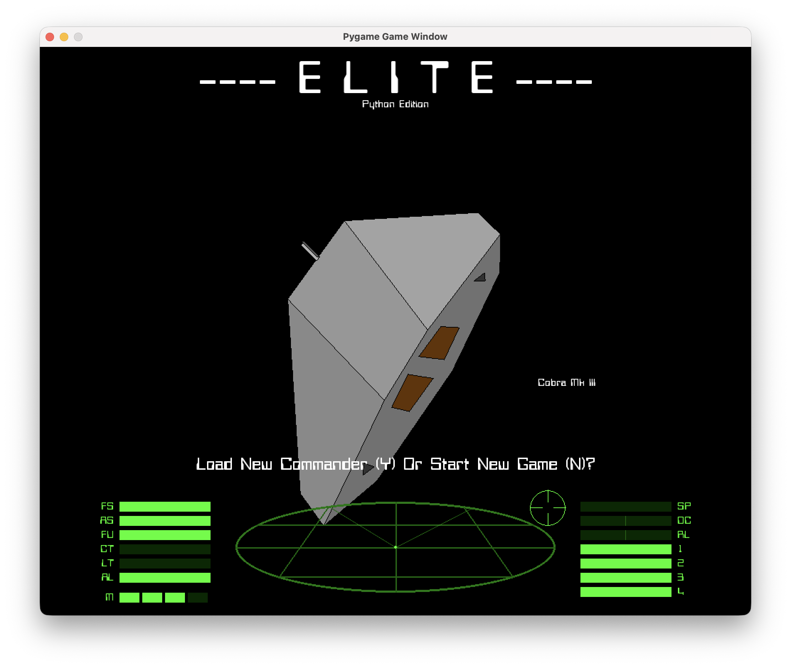
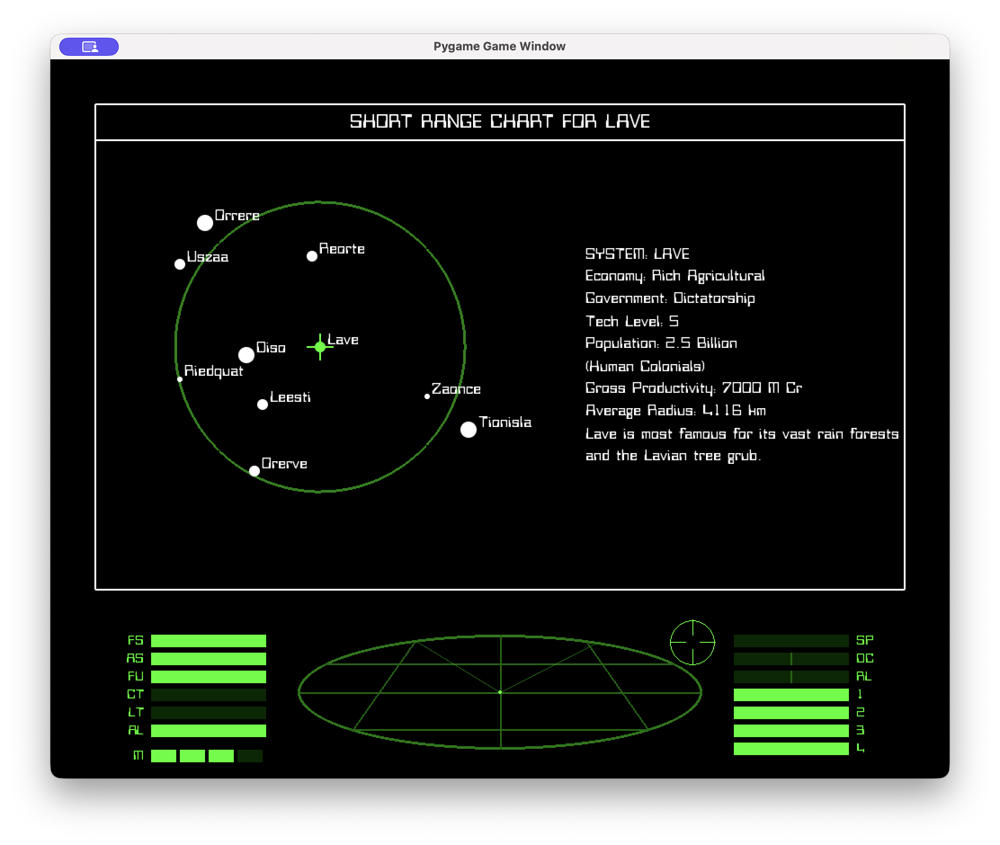
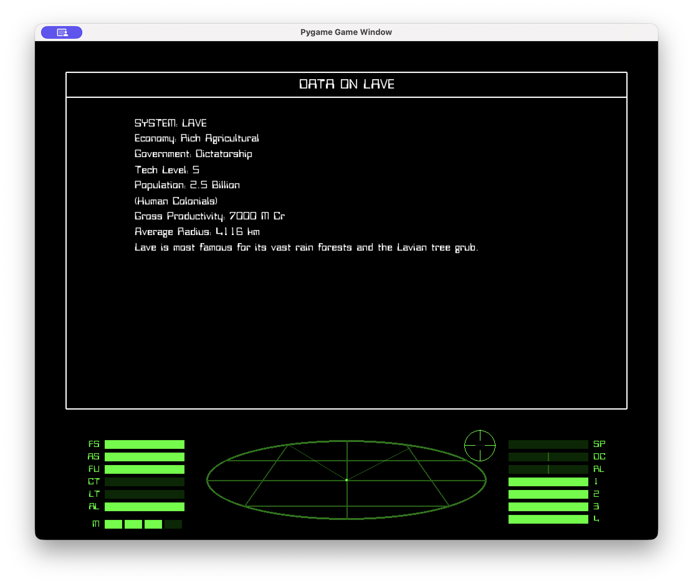
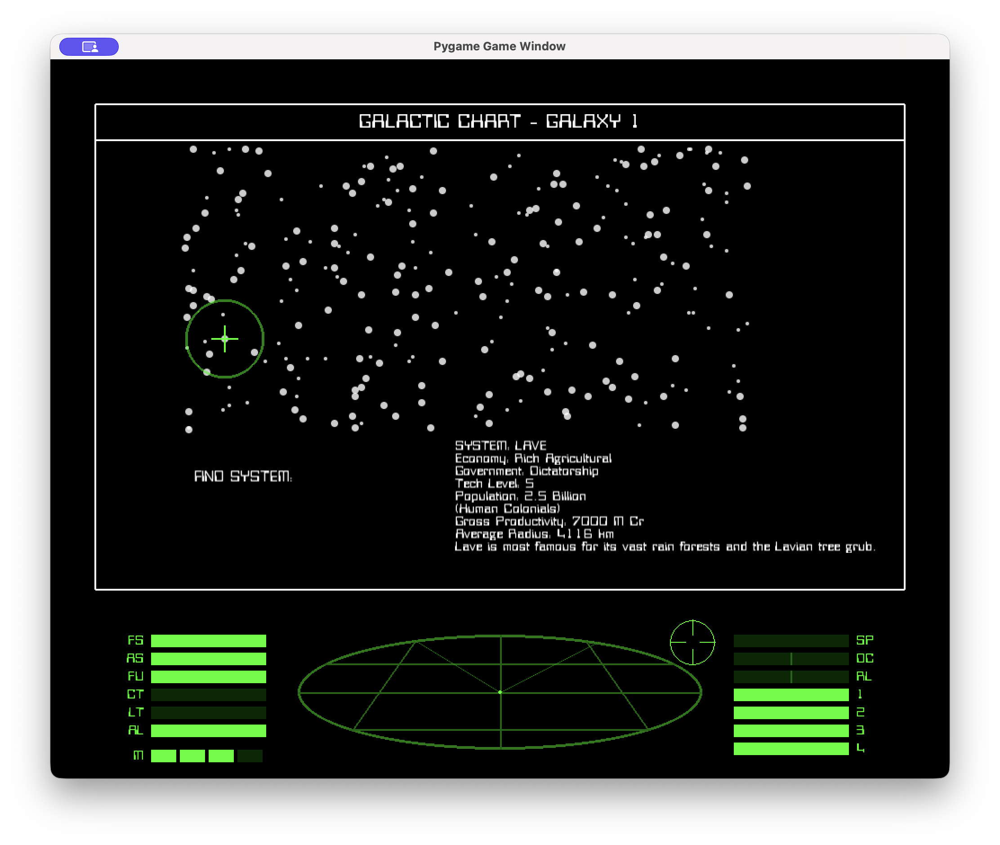
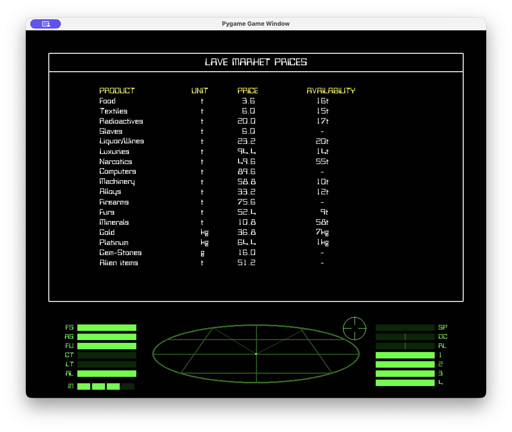
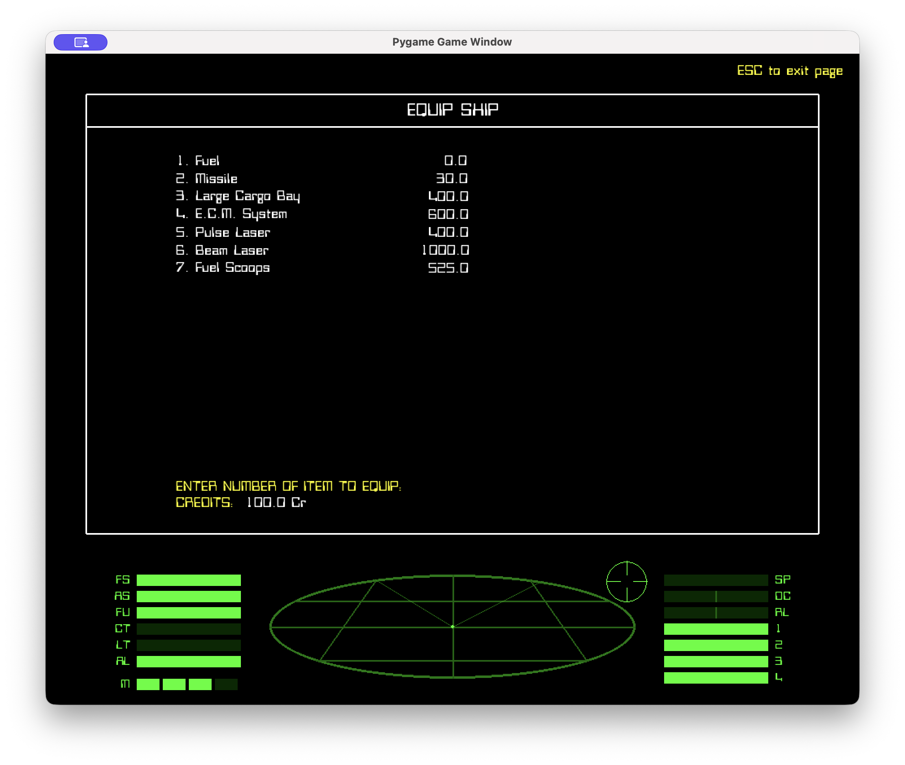
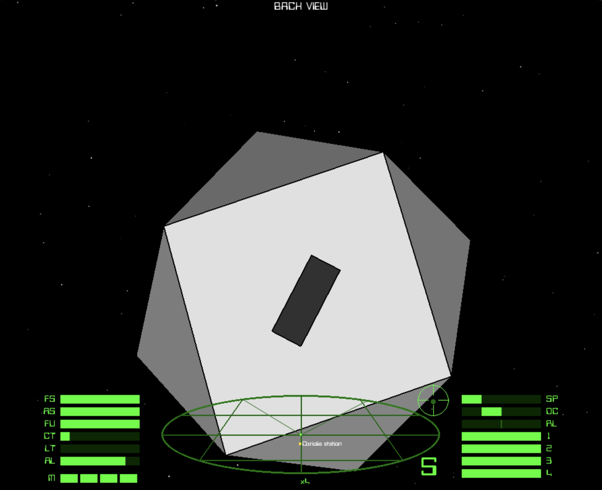
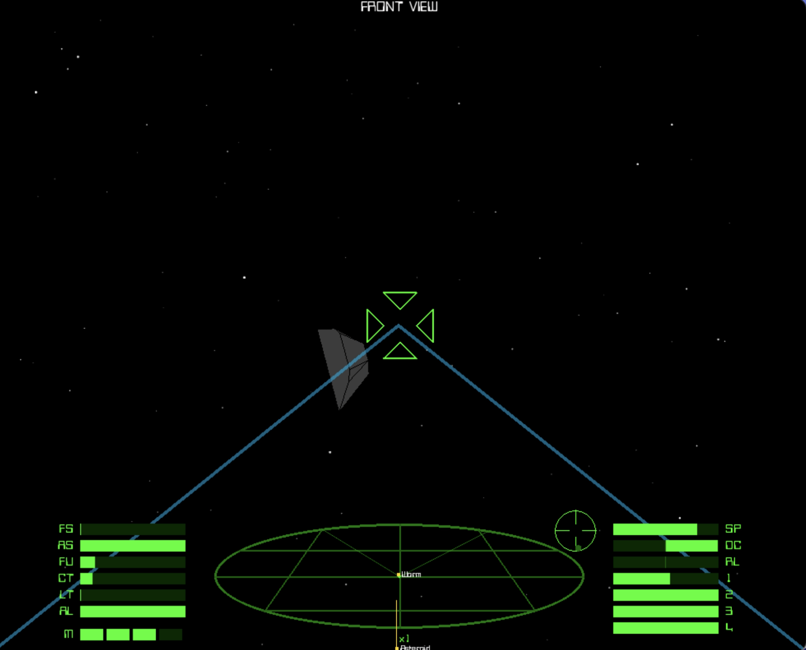
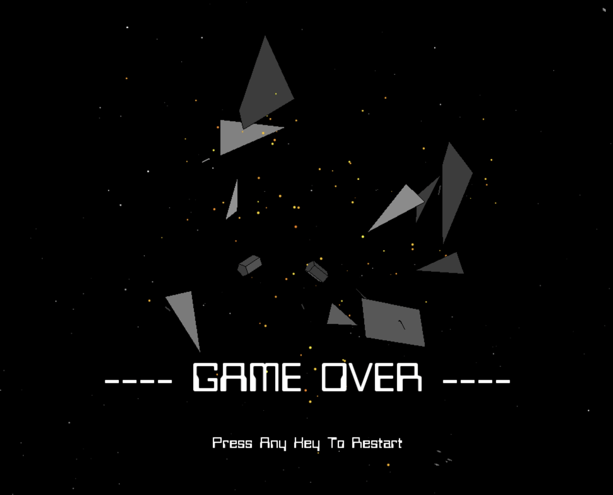

# Elite  - Python Edition.
Click image for Youtube video of title screen with classic C64 Elite Intro music

The classic space trading and combat game in Python.

So, a while ago I decided to have a go at rendering a 3D rotating cube in Python. This project resulted in the creation of a [BattleZone](https://github.com/JSREA31/Pygame_BattleZone) clone using the models and other assets from the [on-line disassembly](https://6502disassembly.com/va-battlezone/) of the original 6502 code.

The dodo space station from elite ended up as an “easter egg” in Battlezone.

I decided to have a go at optimising the rendering of 3D models in Python using OpenGL, I’d used native Pygame rendering functions in Battlezone and these were pretty slow.  I started with the Dodo space station and added some of the other ships from Elite. Somewhere along the line I decided to create a complete version of Elite in Python. I used Mark Moxon’s excellent [complete disassembly of various 6502 based Elites](https://elite.bbcelite.com) and [Ian Bell’s Elite pages](http://www.iancgbell.clara.net/elite/) for info on algorithms, missions and general flow. I’ve also used some sound samples from the 64 version (like the legendary docking music). 

This first release of Elite (Python edition) is based on the C64 version which I played as a teenager. It is more or less complete; you can trade, fight, hyperspace and undertake  missions. The controls are pretty much the same as the C64 version, if you need a reminder I’ve created a summary PDF.

If you've played any of the 6502 Elite's the the screen layout and info screens should be familliar.

When yoiu are docked you can buy, trade and equip your ship. You can view the local and galactic charts get system info, status, inventory and market data at any time.

Short Range chart

System Info

Galaxy Chart

Market Prices

Equip Ship

Click image for Youtube video of actual game play

Flight supports all of the options in the original. Multiple laser types, fuel scoops, missiles (with HUD targeting box!), ECM, Energy bomb and the escape pod. You can use the fuel scoops to mine asteroids (with a mining laser), pick up items and skim the sun for fuel. The docking computer music is lifted from the C64 and still sounds awesome.

Two of the missions are supported including the special ship and the Thargoids.

Combat

Game Over!

